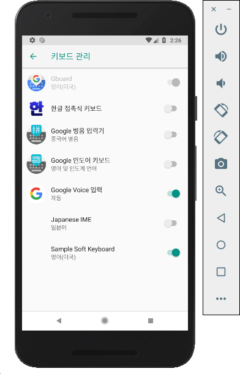

# Android Studio 에뮬레이터에서 한글키보드 설정

이번 Google I/O의 한 섹션 발표자가 농담삼아 한말이 있다.

*'이젠 출근후에 에뮬레이터켰으니 커피뽑으러 가야겠다''라는 말은 통하지 않을 것이다.*

하지만 실제로 출근해서 저 핑계대고 커피마시러 간 사람이 있었을까? 2010년부터 안드로이드 개발을 해온나는 에뮬레이터에 대해서는 인식이 좋지 않았다. 그당시 에뮬레이터 기능이 있긴했지만 워낙 느렸기때문에 애초에 에뮬레이터는 사용할 엄두를 내지못했따. 그래서 그냥 사용하던 iOS를 떠나 안드로이드 폰으로 갈아타 Device연결로 테스트를 진행했다.

그런데 이젠 에뮬레이터를 업그레이드 했다고 하니 한번 써봐야할 것같단 생각이 들었다. 

에뮬레이터를 설정하고 나니 한글이 입력되지 않는다. 

처음 쓰다보니 이런 기초적인 설정에 대해서도 블로깅을 하기로 했다.

각설하고 아래는 한글 설정하는 방법이다.

1. hangulkeyboard.apk 파일을 다운로드 받는다.

2. 다운받은 파일을 안드로이드 SDK폴더(.../Android/SDK/platform-tools/)로 이동한다. 

3. hangulkeyboard.apk 파일을 설치한다.

   ~~~bash
   $ adb install ~/Library/Android/sdk/platform-tools/hangulkeyboard.apk 
   ~~~

4. 에뮬레이터의 Setting > 시스템 > 언어 및 입력 > 가상 키보드 > 키보드 관리로 이동한다.

   

   

5. `한글 접촉식 키보드` 를 활성화 하면 끝!

